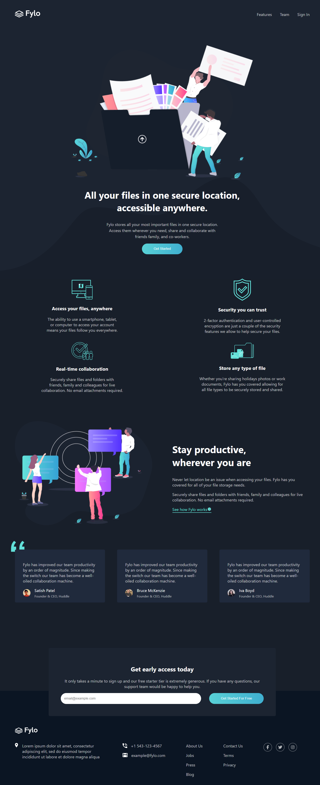

# Frontend Mentor - Fylo dark theme landing page solution

This is a solution to the [Fylo dark theme landing page challenge on Frontend Mentor](https://www.frontendmentor.io/challenges/fylo-dark-theme-landing-page-5ca5f2d21e82137ec91a50fd). Frontend Mentor challenges help you improve your coding skills by building realistic projects.

## Table of contents

- [Overview](#overview)
  - [Screenshot](#screenshot)
  - [Links](#links)
- [My process](#my-process)
  - [Built with](#built-with)
- [Author](#author)

## Overview

### Screenshot

### Links

- Solution URL: [here](https://www.frontendmentor.io/solutions/fylo-landing-page-vtynpOdA7a)
- Live Site URL: [live demo](https://fylo-landing-page-with-dark-theme-and-features-grid-gamma.vercel.app/)

## My process

### Built with

- Semantic HTML5 markup
- CSS custom properties
- Flexbox
- CSS Grid

## Author

- Website - [douiri.org](https://www.douiri.org)
- Frontend Mentor - [@AstroDriss](https://www.frontendmentor.io/profile/AstroDriss)
